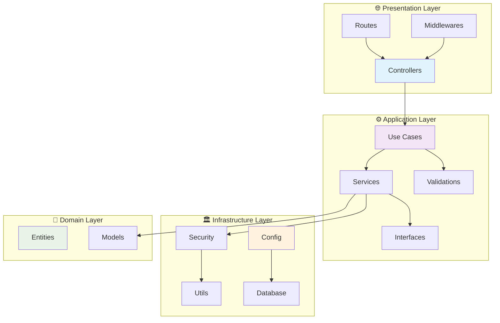
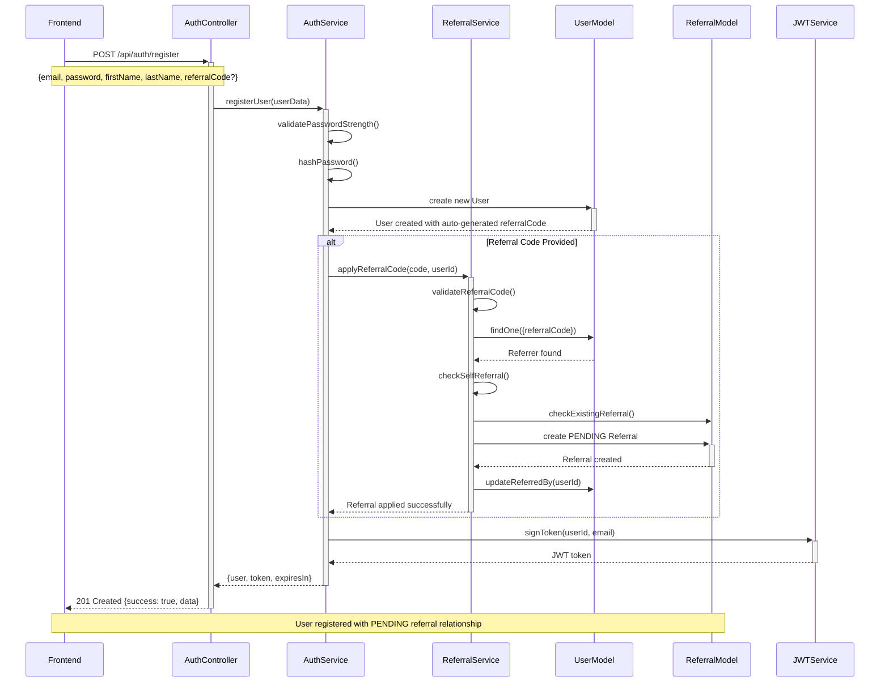
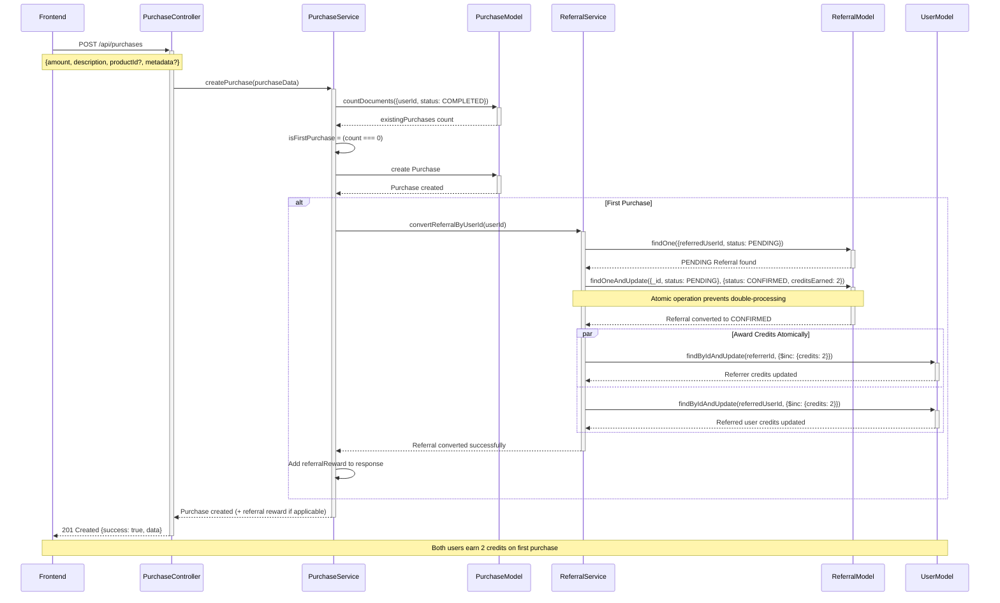
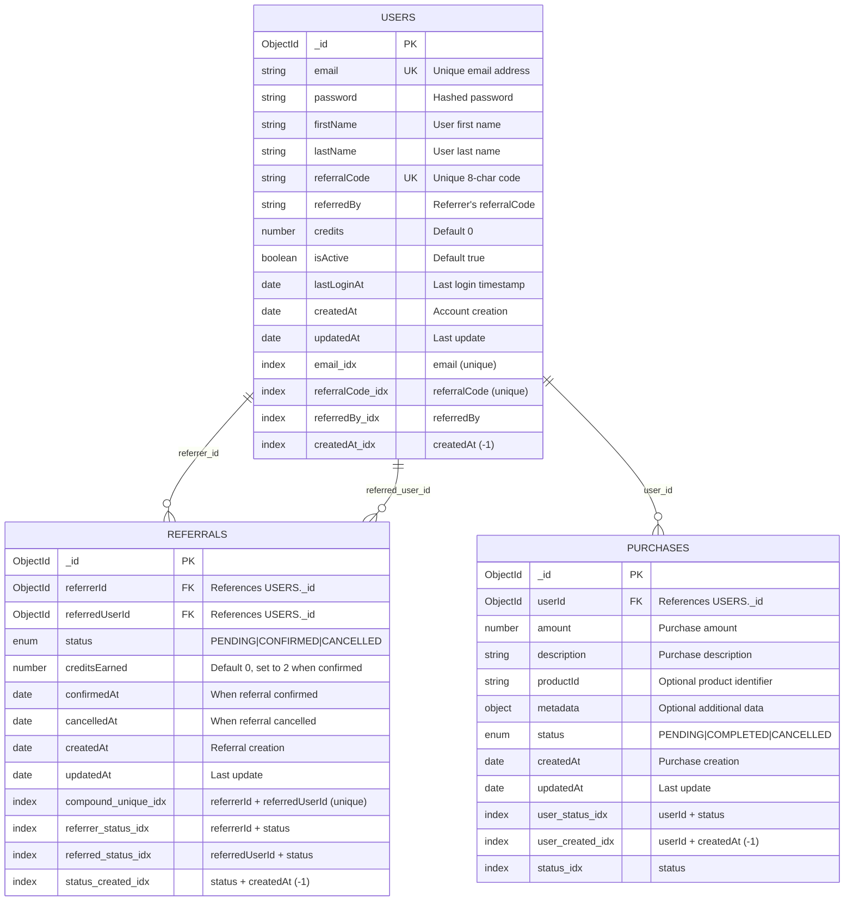
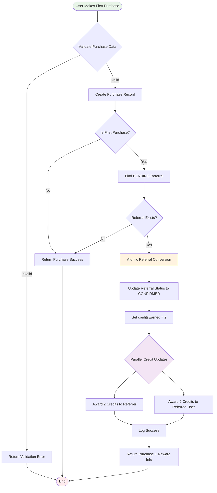
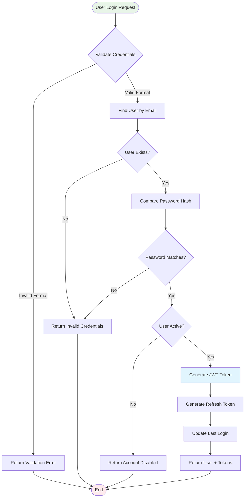
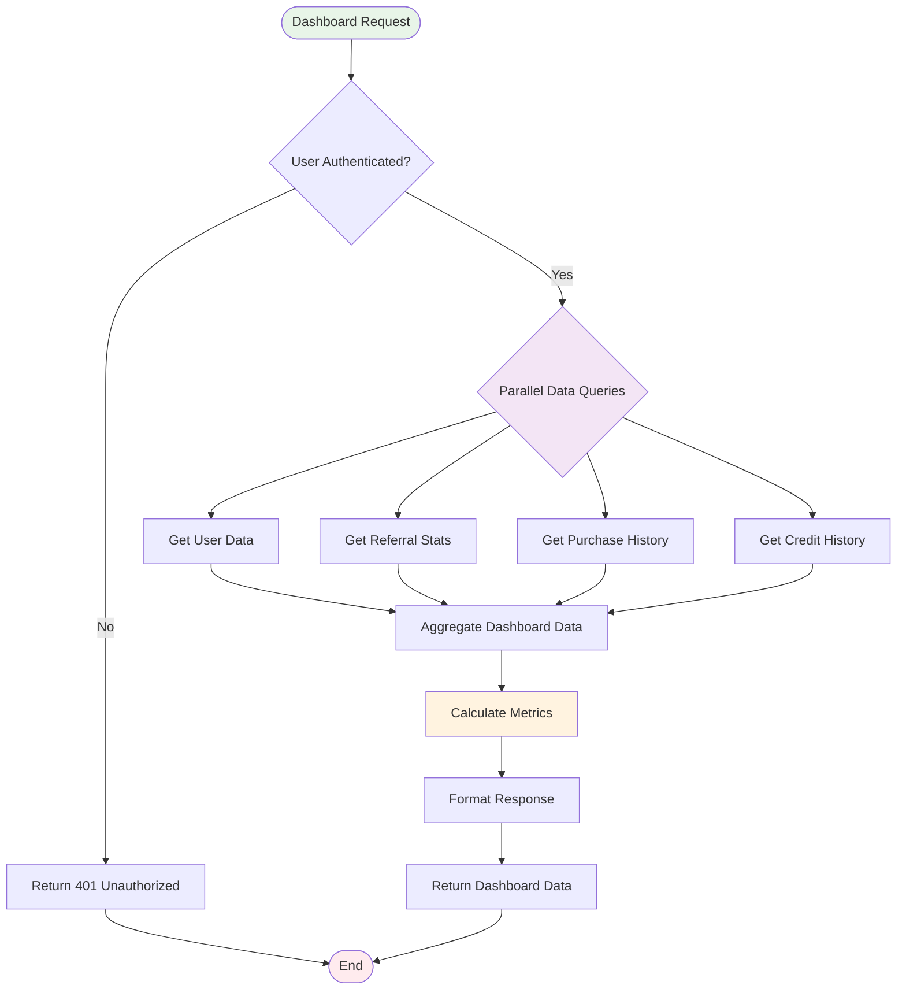
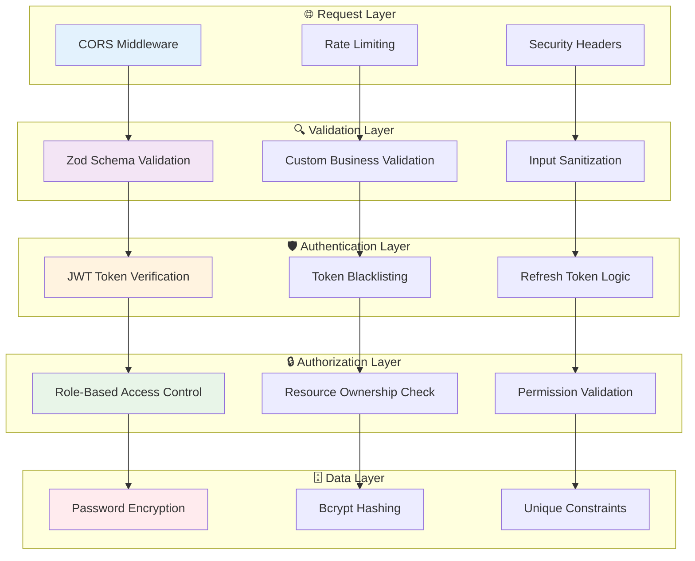
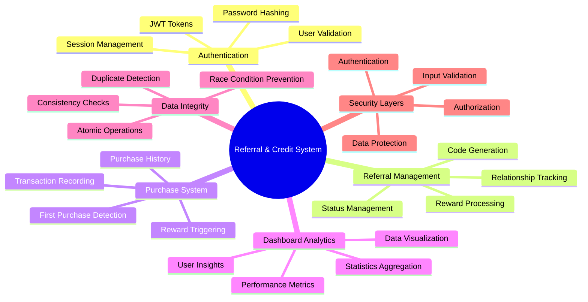

# 🏗️ UML System Architecture & Data Flow

This document contains comprehensive UML diagrams explaining the **Referral & Credit System** architecture, data relationships, and business process flows.

---

## 📐 System Architecture Overview

### 🏛️ Clean Architecture Layers Diagram



---

## 🗂️ Domain Model - Class Diagram

### 📊 Core Entities & Relationships

```mermaid
classDiagram
    class User {
        +ObjectId _id
        +String email
        +String password
        +String firstName
        +String lastName
        +String referralCode
        +String referredBy
        +Number credits
        +Boolean isActive
        +Date lastLoginAt
        +Date createdAt
        +Date updatedAt
        +generateReferralCode()
        +validatePassword()
    }

    class Referral {
        +ObjectId _id
        +ObjectId referrerId
        +ObjectId referredUserId
        +ReferralStatus status
        +Number creditsEarned
        +Date confirmedAt
        +Date cancelledAt
        +Date createdAt
        +Date updatedAt
        +convertToPending()
        +convertToConfirmed()
    }

    class Purchase {
        +ObjectId _id
        +ObjectId userId
        +Number amount
        +String description
        +String productId
        +Object metadata
        +PurchaseStatus status
        +Date createdAt
        +Date updatedAt
        +isFirstPurchase()
        +triggerReferralReward()
    }

    class Credit {
        +ObjectId _id
        +ObjectId userId
        +Number amount
        +String source
        +String description
        +Date createdAt
        +calculateBalance()
    }

    User ||--o{ Referral : "referrer"
    User ||--o{ Referral : "referred"
    User ||--o{ Purchase : "makes"
    User ||--o{ Credit : "earns"
    Referral ||--o| Credit : "generates"
    Purchase ||--o| Credit : "triggers"

    <<enumeration>> ReferralStatus
    ReferralStatus : PENDING
    ReferralStatus : CONFIRMED
    ReferralStatus : CANCELLED

    <<enumeration>> PurchaseStatus
    PurchaseStatus : PENDING
    PurchaseStatus : COMPLETED
    PurchaseStatus : CANCELLED
```

---

## 🔄 Business Process Flows

### 👤 User Registration with Referral Code Flow



### 🛒 First Purchase Referral Reward Flow



### 🔒 Authentication & Authorization Flow

```mermaid
sequenceDiagram
    participant FE as Frontend
    participant AM as AuthMiddleware
    participant JWT as JWTService
    participant UM as UserModel
    participant C as Controller

    FE->>+AM: Request with Authorization: Bearer <token>
    AM->>AM: Extract token from header

    alt Token Missing
        AM-->>FE: 401 Unauthorized
    else Token Present
        AM->>+JWT: verifyToken(token)

        alt Token Invalid/Expired
            JWT-->>-AM: Error
            AM-->>FE: 401 Unauthorized
        else Token Valid
            JWT-->>-AM: Decoded payload {userId, email}
            AM->>+UM: findById(userId)

            alt User Not Found
                UM-->>-AM: null
                AM-->>FE: 401 Unauthorized
            else User Found
                UM-->>-AM: User data
                AM->>AM: Set req.user = userData
                AM->>+C: next() - continue to controller
                C-->>-FE: Protected resource response
            end
        end
    end
```

---

## 🏗️ Component Architecture Diagram

### 📦 Module Dependencies & Interactions

```mermaid
graph TD
    subgraph "Frontend Application"
        FE[React/Next.js Frontend]
    end

    subgraph "🌐 Presentation Layer"
        direction TB
        AR[Auth Routes]
        RR[Referral Routes]
        PR[Purchase Routes]
        DR[Dashboard Routes]

        AC[Auth Controller]
        RC[Referral Controller]
        PC[Purchase Controller]
        DC[Dashboard Controller]

        AM[Auth Middleware]
        VM[Validation Middleware]
        EM[Error Middleware]
    end

    subgraph "⚙️ Application Layer"
        direction TB
        AUC[Auth Use Cases]
        RUC[Referral Use Cases]
        PUC[Purchase Use Cases]
        DUC[Dashboard Use Cases]

        ASV[Auth Service]
        RSV[Referral Service]
        PSV[Purchase Service]
        DSV[Dashboard Service]

        AI[Interfaces/DTOs]
        AV[Zod Validations]
    end

    subgraph "🏛️ Infrastructure Layer"
        direction TB
        JWTD[JWT Service]
        HASH[Hash Service]
        LOG[Logger]
        ENV[Environment Config]
        DB[Database Config]
    end

    subgraph "💎 Domain Layer"
        direction TB
        USER[User Model]
        REF[Referral Model]
        PUR[Purchase Model]
        ENT[Entities]
    end

    subgraph "🗄️ External Systems"
        MONGO[(MongoDB)]
    end

    FE --> AR
    FE --> RR
    FE --> PR
    FE --> DR

    AR --> AC
    RR --> RC
    PR --> PC
    DR --> DC

    AC --> AM
    RC --> AM
    PC --> AM
    DC --> AM

    AC --> VM
    RC --> VM
    PC --> VM
    DC --> VM

    AC --> AUC
    RC --> RUC
    PC --> PUC
    DC --> DUC

    AUC --> ASV
    RUC --> RSV
    PUC --> PSV
    DUC --> DSV

    ASV --> JWTD
    ASV --> HASH
    RSV --> LOG
    PSV --> LOG
    DSV --> LOG

    ASV --> USER
    RSV --> REF
    PSV --> PUR
    DSV --> USER
    DSV --> REF
    DSV --> PUR

    USER --> MONGO
    REF --> MONGO
    PUR --> MONGO

    DB --> MONGO

    style FE fill:#e3f2fd
    style AR fill:#e1f5fe
    style ASV fill:#f3e5f5
    style JWTD fill:#fff3e0
    style USER fill:#e8f5e8
    style MONGO fill:#ffebee
```



---

## 🗄️ Database Schema & Relationships

### 📊 Entity Relationship Diagram (ERD)



---

## 🔄 Data Flow Diagrams

### 💫 Credit Earning Data Flow



### 🔒 Authentication Data Flow



### 📊 Dashboard Data Aggregation Flow



---

## 🛡️ Security & Validation Architecture

### 🔐 Multi-Layer Security Model



---

## 📋 System Interaction Summary

### 🎯 Key Integration Points



---

## 📈 Performance & Scalability Considerations

### ⚡ Database Query Optimization

```mermaid
graph LR
    subgraph "Query Patterns"
        Q1[User Login by Email]
        Q2[Referral Stats Aggregation]
        Q3[First Purchase Detection]
        Q4[Dashboard Data Loading]
    end

    subgraph "Index Strategy"
        I1[email (unique)]
        I2[referralCode (unique)]
        I3[referrerId + status (compound)]
        I4[userId + status (compound)]
    end

    subgraph "Performance Benefits"
        P1[O(1) User Lookup]
        P2[Fast Referral Validation]
        P3[Efficient Stats Queries]
        P4[Quick Purchase Checks]
    end

    Q1 --> I1 --> P1
    Q2 --> I3 --> P3
    Q3 --> I4 --> P4
    Q4 --> I2 --> P2

    style Q1 fill:#e3f2fd
    style I1 fill:#f3e5f5
    style P1 fill:#e8f5e8
```

This comprehensive UML documentation provides visual representations of:

- ✅ **System Architecture** with Clean Architecture layers
- ✅ **Domain Models** with entity relationships
- ✅ **Business Process Flows** with sequence diagrams
- ✅ **Component Dependencies** and interactions
- ✅ **Database Schema** with ERD
- ✅ **Data Flow Diagrams** for key processes
- ✅ **Security Architecture** with multi-layer protection
- ✅ **Performance Considerations** and optimization strategies

All diagrams use **Mermaid syntax** and can be rendered in GitHub, GitLab, or any Mermaid-compatible viewer! 🚀
